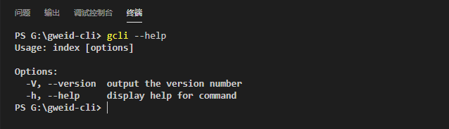
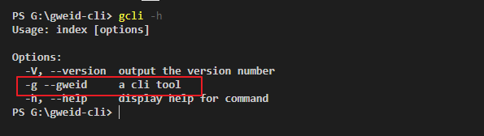

# 利用 Node 开发脚手架工具


## 1、初始化及一些基础知识


### 1.1、初始化

1. 通过 `npm init -y` 初始化 npm 环境

2. 在根目录下面创建 index.js

3. 将 index.js 设置为入口文件，即确保 package.json 中： main 的值为 index.js

   ```js
   {
     "main": "index.js",
   }
   ```


所以现在基本结构：

```
gweid-cli
├── doc // 一些说明文档
├── index.js
├── package.json
└── readme.md
```


### 1.2、创建 gcli 命令

先看期望结果：实现 gcli 命令，执行 `gcli --version` 会输出版本号

1. 首先，在入口文件 index.js 中，添加指令：

   ```js
   #!usr/bin/env node
   
   console.log('1.0.0')
   ```

   #! 这种开头的叫做 shebang 或者 hashbang

   `#!usr/bin/env node` 代表在当前电脑环境里面查找 node 指令，找到 node，那么 index.js 后续的代码将交给 node 来执行，相当于执行 `node index.js`

2. 在 package.json 中配置 gcli 指令

   ```js
   {
     "bin": {
       "gcli": "index"
     }
   }
   ```

3. 执行 `npm link`。这一步主要就是将 package.json 中的 bin 下的 gcli 命令配置到终端的环境变量里面。当环境变量中有了 gcli 命令，那么执行 gcli 命令就不会报错找不到 gcli 指令了

   > 这一步可能报错：no such file or directory...，这可能是使用了例如 taobao 之类的镜像源，使用 nrm 切换会 npm 镜像源

经过上面三步，再执行 gcli 就可以成功输出版本号 1.0.0 了


### 1.3、npm link 调试

将脚手架链接到本地，进行调试：

```shell
cd gweid-cli
npm link
```


脚手架使用本地包，需要链接本地包：

```shell
# 先进入本地包根目录，将本地包链接到全局
cd package
npm link

# 脚手架链接本地包
cd gweid-cli
npm link package
```


解除链接：

```shell
# 解除 gweid-cli 对 package 的链接
cd gweid-cli
npm unlink package

# 解除 package 全局链接
cd package
npm unlink
```


## 2、Commander

经过上面的初始化，已经可以通过 gcli 输出版本号了，但是这个版本号以及 gcli 命令太死板了。

例如一些第三方库如 vue-cli，当使用 `vue --version` 是输出版本号，`vue -h` 是输出一些帮助信息。

像这些优秀的开源库实现的这些功能，其实很多都是使用 Commander 库实现的。Commander 库官方文档：https://github.com/tj/commander.js/blob/master/Readme_zh-CN.md


### 2.1、Commander 库的基本使用

这里以 `gcli --version` 输出版本信息为例子，展开说明 Commander 库的基本使用


#### 2.1.1、安装 Commander 库

```js
npm i commander
```


#### 2.1.2、使用 commander

```js
#! /usr/bin/env node

const { program } = require('commander')

// 使用 program.version 定义版本
program.version('1.0.0')

// 使用 program.parse 解析传进来的参数，比如 gcli --version，后面的 --version 就是参数
// program.args 获取的就是传进来的参数
program.parse(program.args)
```


#### 2.1.3、动态获取 packahe.json 版本号

在定义版本的时候，从 package.json 中获取

```js
program.version(require('./package.json').version)
```


通过上面三步，再在终端输入 `gcli --version` 就可以输出版本号，并且版本号随着 package.json 的 version 而变化。

通过 program.version 设置了 version，既支持 `gcli --version`，也支持 `gcli -V`，commander 默认就是使用这两种方式获取设定的版本号。


### 2.2、commander 的 option

直接在终端输入 `gcli --help`，会出现：



此时就会有一个疑惑，明明没有在 index.js 中定义过 --help，为什么会有输出呢？因为这个是 commander 的默认值。

我们也可以自定义 options


#### 2.2.1、自定义 commander 的 option

只需要往 index.js 中添加

```js
program.option('-g --gweid', 'a cli tool')
```

- 第一个参数：就是定义 option 指令
- 第二个参数：对这个指令的描述

再执行 `gcli -h`，会发现多了 -g：




多个 option 可以声明多个 program.option 也可以链式调用，例如：

```js
program.option('-g --gweid', 'a cli tool')
program.option('-d --dest <dest>', 'a destination folder, example: -d src/modules')

// 或者链式调用
program
  .option('-g --gweid', 'a cli tool')
  .option('-d --dest <dest>', 'a destination folder, example: -d src/modules')
```


#### 2.2.2、通过 option 传参

自定义 option 有什么用呢？主要是可以用来传参数以及接收参数。

比如，像 webpack，可以 `webpack --config xxx/webpack.config.js` 可以通过 --config 后面的参数指定需要使用的 webpack.config.js 文件

> index.js

```js
const { program } = require('commander')

program.option('-d --dest <dest>', 'a destination folder, example: -d src/modules')
program.parse(process.argv)
// 要想获取参数，必须在 program.parse 解析完之后
console.log(program.opts().dest)
```

后面的 `<dest>` 就代表接收参数，那么在 pogram.parse 解析完参数之后，就可以通过 program.opts().dest 获取到值。例如执行：`gcli -d src/modules`  通过 program.opts().dest 获取到 src/modules。


#### 2.2.3、监听 --help

只需要在 index.js 中添加：

```js
program.on('--help', function() {
  console.log('哈哈哈')
})
```

那么无论是执行 `gcli --help` 还是 `gcli -h` 都能监听到。并且这个监听只能监听默认的 `--help` 指令


### 2.3、commander 创建指令

像 vue-cli 可以通过 `vue create xxx` 创建项目，这个 create 就属于一个指令。

我们也希望通过 `gcli create xxx` 的方式创建一个项目。


#### 2.3.1、command 创建指令

```js
program
    .command('create <project> [others...]') // 创建一个 create 指令
    .description('clone a repository into a newly created directory') // 描述 create 指令
    .action((project, others) => {
      // 是当执行 gcli create 命令的时候触发 action
      console.log(project, others)
    })
```

通过 command 创建一个指令

- `<project>`：需要传进来项目名字
- [others...]：代表其他参数，比如 `gcli create demo hahaha mamamam`，就是 demo 后面的两个


## 3、下载 github 模板

可以使用 download-git-repo 包去下载 github 的模板：https://www.npmjs.com/package/download-git-repo

vue-cli 也是使用的 download-git-repo，可以查看 vue-cli：https://github.com/vuejs/vue-cli/blob/dev/packages/%40vue/cli/package.json


基本使用：

```js
const { promisify } = require('util')

// 因为 download-git-repo 不支持 promise
// 所以使用 node 内置模块 util 的 promisify 函数将 download-git-repo 转为 promise 形式
// promisify 的原理很简单，就是给 download-git-repo 包一层 promise
const download = promisify(require('download-git-repo'))

await download('direct:https://github.com/xxx.git', 'demo', { clone: true })
```

- path：模板所在的仓库地址
- project：需要将下载下来的代码放到哪个文件夹
- clone：是否使用 clone 方式将项目 download 下来


download-git-repo 下载的方式有很多种，一般使用以下搭配

- 地址前加 direct
- clone: 设置为 true

```js
download('direct:https://github.com/xxx.git', 'demo', { clone: true })
```


## 4、Node 进程 child_process 的使用 


## 开发脚手架

```
gweid-cli
├── doc // 脚手架开发过程文档
├── lib // 脚手架代码
│   ├── config // 配置相关
│   ├── core // 核心代码
│   ├── template // 模板 template
│   └── utils // 工具
├── index.js // 入口文件
├── .gitignore
├── package-lock.json
├── package.json
└── readme.md
```


